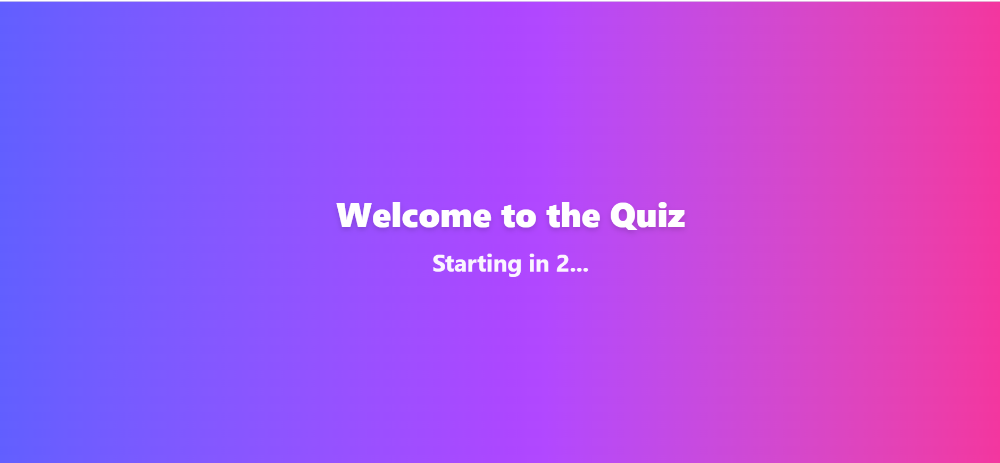
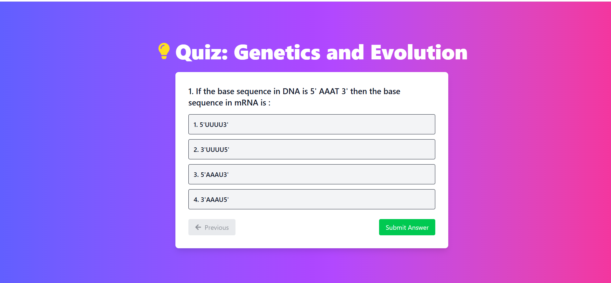
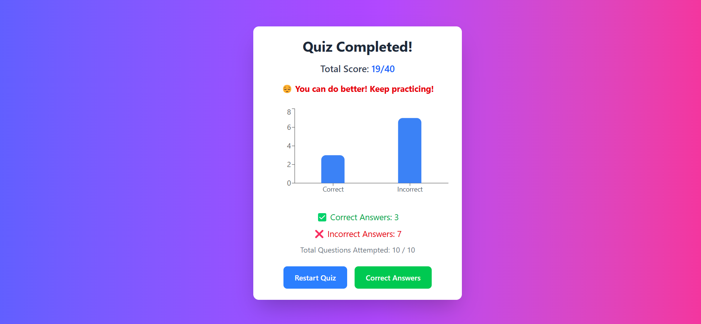
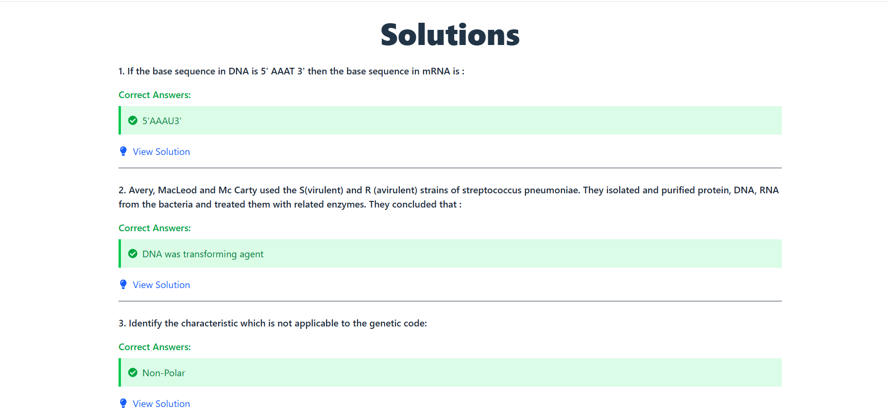

# Testline assignment 
## Overview

This **Quiz Project** is a web based quiz application built using Express.js, React, and Node.js. This documentation provides instructions on setting up and running both the backend and frontend of the project.

---

## Prerequisites

Ensure you have the following installed:

- [Node.js](https://nodejs.org/) (v18 or later recommended)
- [Git](https://git-scm.com/)
- [Postman](https://www.postman.com/) (for API testing, optional)

---

## Project Setup

### 1. Clone the Repository

```bash
git clone <https://github.com/saumyasingh003/Testline.git>
cd testline

```

### 2. Setup Backend

### Navigate to Backend Directory

```bash
cd backend

```

### Install Dependencies

```bash
npm install

```

### Run the Backend Server

```bash
npm start

```

The server should start on `http://localhost:4000/`

---

### 3. Setup Frontend

### Navigate to Frontend Directory

```bash
cd ../quiz

```

### Install Dependencies

```bash
npm install

```

### Run the Frontend Server

```bash
npm run dev

```

The frontend should now be available at `http://localhost:3000/`

---

---

## API Endpoints

### Taking Quizzes

| Method | Endpoint | Description |
| --- | --- | --- |
| GET | `/api/quiz` | Get quiz |

---

### Screenshots









### Video Link

[https://drive.google.com/file/d/1XreORqve3cA9WD3a-0gy5EW_W5vS27Nb/view?usp=sharing](https://drive.google.com/file/d/1XreORqve3cA9WD3a-0gy5EW_W5vS27Nb/view?usp=sharing)